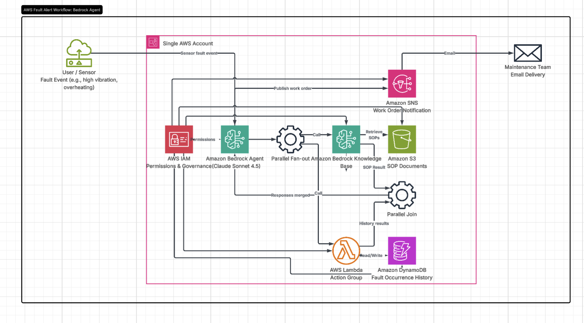

# Plant Floor Agent — AWS Bedrock Predictive Maintenance

Real AWS Bedrock-based agentic pipeline for industrial fault triage, built for
Automotive & Manufacturing use cases.

## Architecture

- **S3**: stores maintenance SOP documents
- **Amazon Bedrock Knowledge Base** (OpenSearch Serverless vector store): RAG retrieval over SOPs
- **AWS Lambda**: orchestrates fault detection, KB retrieval, and reasoning
- **Amazon Bedrock (Claude 3.5 Sonnet)**: generates the work order summary and escalation decision
- **DynamoDB**: tracks recurring faults per machine (acts as agent "memory")
- **SNS**: delivers the generated work order to maintenance staff

## Flow
1. Sensor reading (vibration/temp) is sent to Lambda
2. Lambda detects fault type via threshold rule
3. Increments fault occurrence count in DynamoDB
4. Retrieves the matching SOP from the Bedrock Knowledge Base
5. Claude 3.5 Sonnet generates a work order, deciding whether to escalate based on recurrence and severity
6. Work order is published via SNS

## Part 2: Native Bedrock Agent



Upgraded the architecture from a single orchestrating Lambda to a native Amazon Bedrock Agent that owns the reasoning loop itself:

- Agent (tested with both Claude Sonnet 4.5 and Amazon Nova Pro) interprets the request and decides which tools to call
- Knowledge Base association for automatic SOP retrieval
- Action group (Lambda) exposing `createWorkOrder` and `checkFaultHistory` as callable tools, defined via OpenAPI schema (`agent/action-group-schema.json`)

This shifts orchestration logic from hardcoded Python control flow into the agent's own planning — the architectural difference between "an app that calls an LLM" and "an actual agent." Verified via trace logs: the agent correctly planned and executed parallel tool calls (Knowledge Base search + fault history lookup) without explicit sequencing in code.

### Known limitation: Knowledge Base vector store compatibility

As of the AWS console's current Knowledge Base creation flow (June 2026), quick-create only offers a **"Managed vector store"** type (`knowledgeBaseConfiguration.type: MANAGED`), with no UI option to select Amazon OpenSearch Serverless directly. This was confirmed via:

```bash
aws bedrock-agent get-knowledge-base --knowledge-base-id 
# → "knowledgeBaseConfiguration": { "type": "MANAGED" }
```

The Bedrock Agents `associate-agent-knowledge-base` / retrieval API currently expects the legacy `vectorSearchConfiguration` shape, which is incompatible with this newer managed type, producing:
Incompatible configuration: vectorSearchConfiguration is not supported for

managed knowledge bases. Use managedSearchConfiguration instead.
This reproduced consistently across two independently created Knowledge Bases and two different foundation models (Claude Sonnet 4.5 and Amazon Nova Pro) — isolating the failure to the Knowledge Base storage layer, not the agent's model or orchestration logic, which was independently verified working via full trace inspection.

**Workaround (documented, not yet executed):** create the Knowledge Base via the `bedrock-agent create-knowledge-base` API directly, explicitly specifying `storageConfiguration.type: OPENSEARCH_SERVERLESS` against a manually provisioned OpenSearch Serverless collection (collection, encryption policy, network policy, and vector index created ahead of time) — bypassing the console's quick-create flow, which currently defaults to the incompatible managed type.

### Status

- Lambda-orchestrated agent (Part 1): fully functional, tested end-to-end with real Bedrock model output
- Bedrock Agent (Part 2): action group and agent orchestration fully built and verified via trace logs (tool planning, parallel calls, correct reasoning); Knowledge Base retrieval blocked by the platform-level compatibility gap above; resolution path identified and documented

